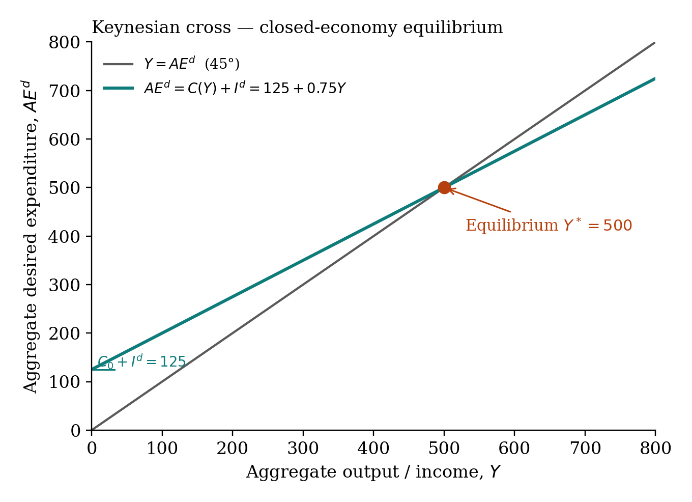
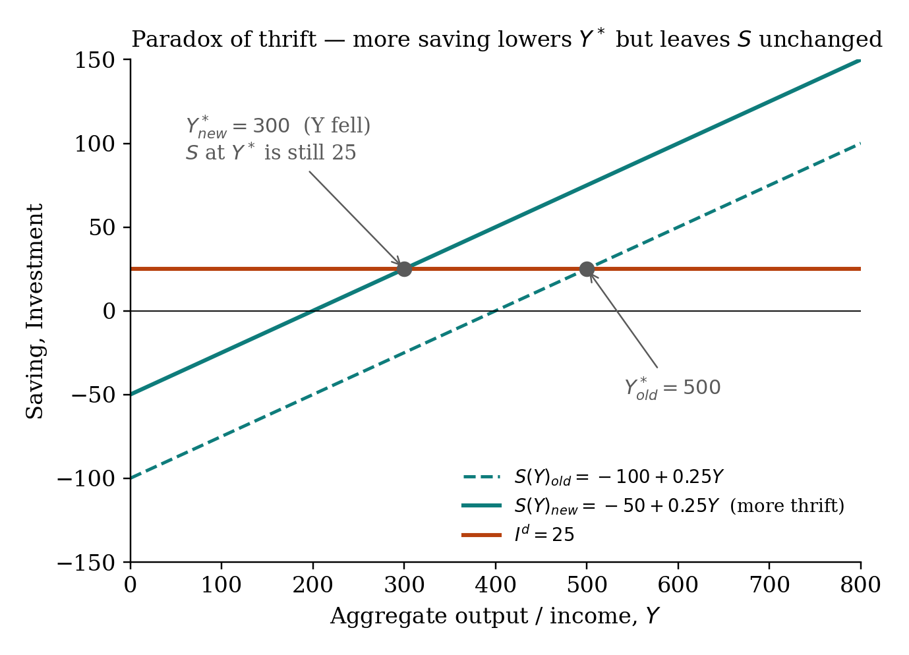

## The simplest closed-economy model

Households consume out of income; firms invest a fixed amount that doesn't depend on $Y$.

$$AE^d = C(Y) + I^d \quad\text{where } C(Y) = \overline{C_0} + cY \text{ and } I^d = \overline{I}$$

Equilibrium output is the level where firms' production exactly matches what households and firms want to spend:

$$Y = AE^d$$

Substitute and solve:

$$Y = \overline{C_0} + cY + \overline{I}$$
$$(1 - c) Y = \overline{C_0} + \overline{I}$$
$$\boxed{\;Y^* = \dfrac{\overline{C_0} + \overline{I}}{1 - c}\;}$$

## The cross diagram

The 45° line plots $Y = AE^d$ — the equilibrium condition. The $AE^d$ schedule plots desired expenditure as a function of $Y$. They cross at $Y^*$.

{fig-align="center" width="80%"}

## Off-equilibrium adjustment

Actual investment includes any unintended buildup or rundown of inventory:

$$I_{\text{actual}} = I_{\text{planned}} + \Delta\text{unplanned inventory}$$

If $Y > AE^d$: production exceeds desired demand. Inventory accumulates (unplanned). Firms cut output. $Y$ falls toward $Y^*$.

If $Y < AE^d$: desired demand exceeds production. Inventory runs down. Firms expand. $Y$ rises toward $Y^*$.

At $Y^*$: unplanned inventory change is zero.

## The saving = investment alternative

In the closed-economy frugal model, $Y \equiv C + S$ and $AE^d = C + I^d$. At equilibrium:

$$C + S = C + I^d \quad\Rightarrow\quad S = I^d$$

This gives a second way to find $Y^*$: where the saving function $S(Y) = -\overline{C_0} + (1-c)Y$ crosses the horizontal $I^d$ line.

## Paradox of thrift

If households become more frugal — subsistence consumption $\overline{C_0}$ falls — the saving function shifts up. The new equilibrium has lower $Y^*$. But $S = I^d$ at equilibrium and $I^d$ didn't change, so total saving is unchanged. **More desire to save, no more actual saving, lower output.**

{fig-align="center" width="80%"}

## Try it live

Sliders for MPC, $\overline{C_0}$, $\overline{I}$ are in the [Keynesian Cross tool](../interactive/keynesian-cross-tool.qmd). Watch $Y^*$ and the multiplier update in real time.
