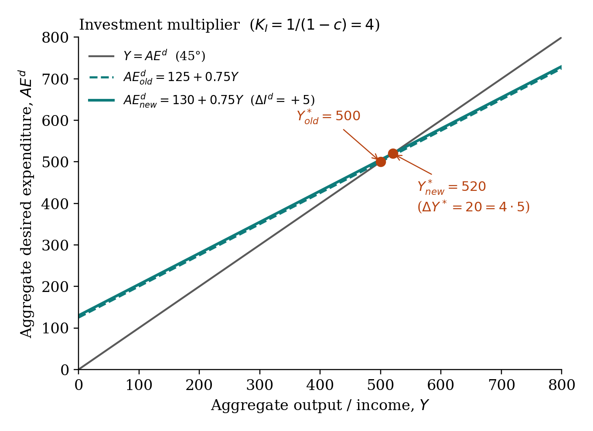

## The general multiplier

For any autonomous variable $\overline{X}$:

$$K_X \equiv \frac{\Delta Y^*}{\Delta \overline{X}}$$

In the open governed economy with consumption $C = \overline{C_0} + c(Y - \overline{T})$, equilibrium is

$$Y^* = \tfrac{1}{1-c}\,\overline{C_0} - \tfrac{c}{1-c}\,\overline{T} + \tfrac{1}{1-c}\,\overline{I} + \tfrac{1}{1-c}\,\overline{G} + \tfrac{1}{1-c}\,\overline{X} - \tfrac{1}{1-c}\,\overline{M}$$

Each multiplier is the coefficient on its own term:

| variable | multiplier | sign |
|---|---:|:---:|
| $\overline{C_0}, \overline{I}, \overline{G}, \overline{X}$ | $\dfrac{1}{1-c}$ | + |
| $\overline{T}$ | $-\dfrac{c}{1-c}$ | – |
| $\overline{M}$ | $-\dfrac{1}{1-c}$ | – |
| $\overline{G}$ and $\overline{T}$ together by same $\Delta$ | $K_{BB} = K_G + K_T = 1$ | + |

At MPC $c = 0.75$: $K_G = 4$, $K_T = -3$, $K_{BB} = 1$.

::: {.callout-tip}
**Mnemonic.** "Spending in, full power. Tax in, lose one round of $c$. Together, exactly one."
:::

## Why the multiplier exists — the geometric series

A $1 increase in $\overline{G}$ raises $Y$ by $1 in round one. Households see income rise by $1 and spend $c$ of it. That's round-two spending. Round three adds $c^2$; round four $c^3$. Sum:

$$\Delta Y = 1 + c + c^2 + c^3 + \cdots = \frac{1}{1-c}$$

This is why $K_G = 1/(1-c)$.

## Why $|K_T|$ is smaller than $K_G$

A dollar of $G$ enters $AE^d$ in full on round one. A dollar of tax cut adds only $c$ to round-one spending — households save $(1-c)$ of it. The lost round-one $(1-c)$ is the entire gap:

$$K_G - |K_T| = \tfrac{1}{1-c} - \tfrac{c}{1-c} = \tfrac{1-c}{1-c} = 1$$

That gap of exactly 1 is the balanced-budget multiplier. Same arithmetic.

::: {.callout-important}
**The real-world multiplier is roughly 1.4, not 4.** The textbook formula assumes no leakages other than saving. Real-world leakages: income-conditional taxes, imports, monetary offset (Fed raises rates as $Y$ rises), crowding-out of private investment. All shrink the multiplier.
:::

{fig-align="center" width="80%"}

## The multiplier dashboard

A live calculator that shows all multipliers for any MPC is at the [Multiplier dashboard](../interactive/multiplier-dashboard.qmd). Move the slider, watch the table.
