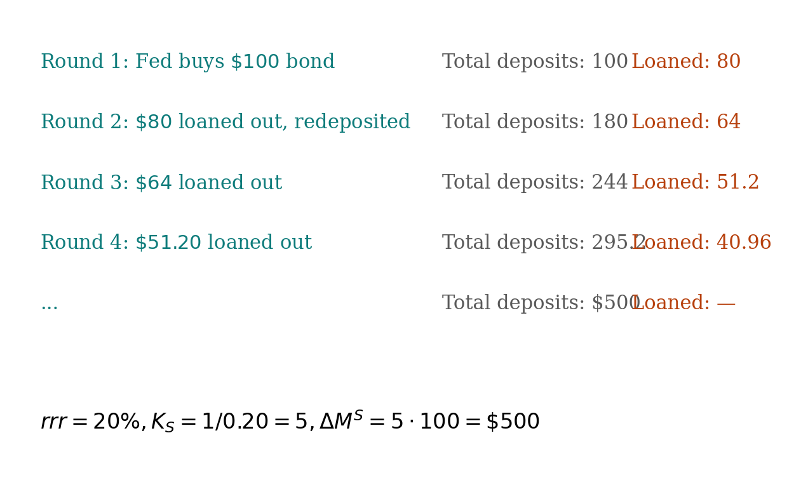

## What money is

A medium of exchange, a store of value, a unit of account. Its key property is **liquidity**.

| type | example |
|---|---|
| Commodity money | Gold |
| Fiat money | U.S. dollar — value by government decree, intrinsically worthless |
| Legal tender | Money the government requires accepted in settlement of debts |

## M1 and M2

| measure | what's in it |
|---|---|
| **M1** | Currency held by public + checkable deposits + travelers' checks + NOW accounts |
| **M2** | M1 + savings deposits + small time deposits + money market mutual funds + near-monies |

Both are stock measures (point in time). M2 is broader and more stable.

## The bank balance sheet

$$\text{Assets} = \text{Liabilities} + \text{Net Worth}$$

| Assets | Liabilities + Net Worth |
|---|---|
| Reserves (vault cash + deposits at Fed) | Demand deposits ($DD_p$) |
| Loans | Other deposits |
| Securities | Net worth |

## Reserves

$$RR = rrr \cdot DD_p \qquad ER = TR - RR$$

Banks earn nothing on $ER$, so they want $ER = 0$. They make loans until $ER$ is exhausted. The act of lending creates new deposits at other banks. **That is how money is created.**

## The money creation chain

Suppose $rrr = 20\%$ and the Fed buys \$100 in bonds from Bank A.

- Bank A receives \$100 in reserves. $RR = 20$, $ER = 80$. Lends \$80.
- Borrower spends; receiver deposits at Bank B. Bank B has \$80 in reserves. $RR = 16$, $ER = 64$. Lends \$64.
- Bank C: lends \$51.20.
- Continue.

Sum of new deposits: $100 + 80 + 64 + 51.2 + \ldots = 100 \cdot \frac{1}{1 - 0.8} = \$500$.

{fig-align="center" width="90%"}

## The money multiplier

$$K_S = \frac{1}{rrr} \qquad \Delta M^S = K_S \cdot \Delta\text{Reserves}$$

::: {.callout-warning}
This is an upper bound. It assumes (1) banks lend until $ER = 0$, and (2) no leakage out of the banking system (no cash held outside banks). Real-world $K_S$ is smaller.
:::

## The Fed

| body | role |
|---|---|
| Board of Governors | Sets policy direction. 7 presidentially-appointed members. |
| FOMC | Sets money-supply and interest-rate targets. |
| Open Market Desk (NY Fed) | Executes the trades daily. |

## The three Fed tools

| tool | how it works | direction |
|---|---|---|
| **rrr** | Lower → banks have more $ER$ to lend | $\downarrow rrr \Rightarrow \uparrow M^S$ |
| **Discount rate** | Lower → banks borrow more from Fed | $\downarrow$ discount $\Rightarrow \uparrow M^S$ |
| **OMO (most-used)** | Buying bonds injects reserves | OMO purchase $\Rightarrow \uparrow M^S$ |

## Try it

The [money creation tool](../interactive/money-creation-tool.qmd) lets you pick $rrr$ and OMO size, and shows the iterative deposit chain plus the geometric sum.
