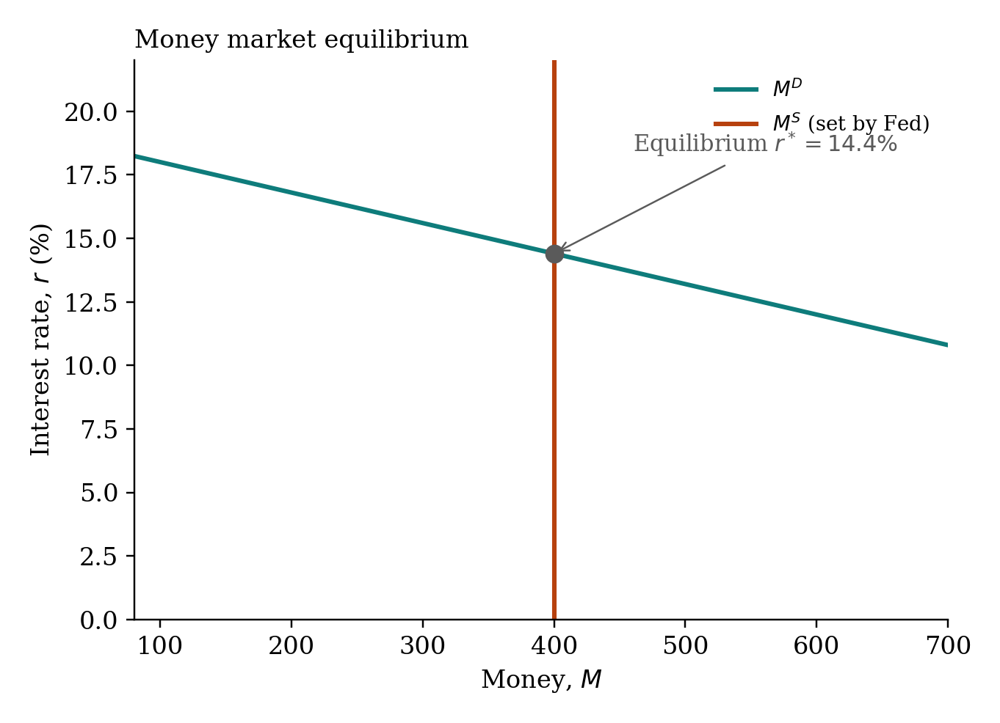
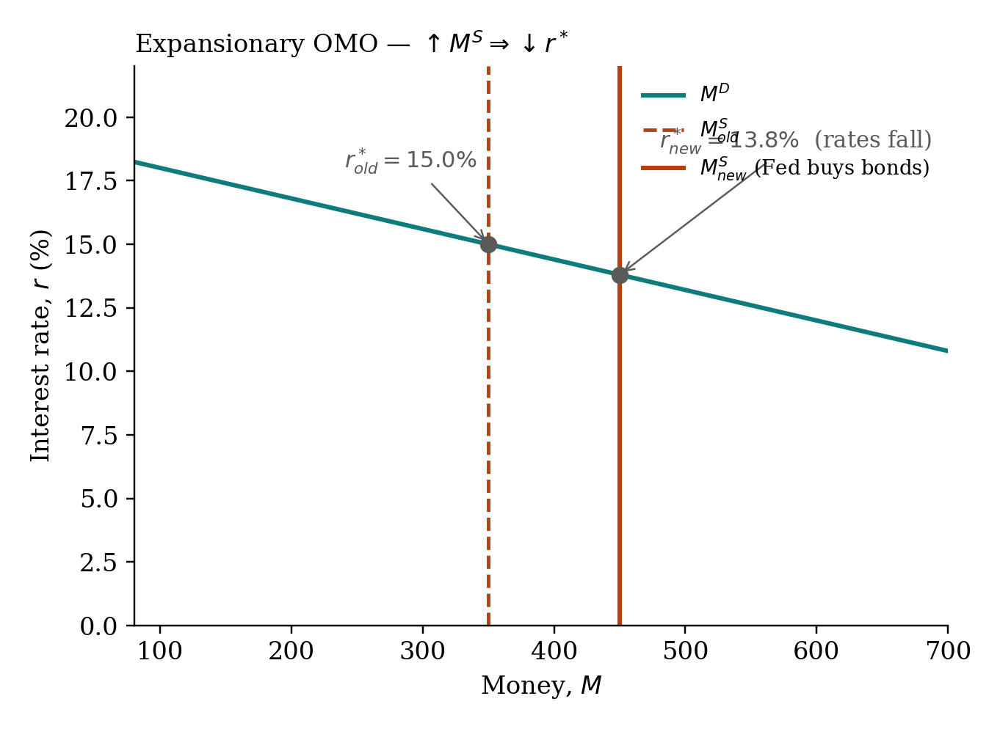
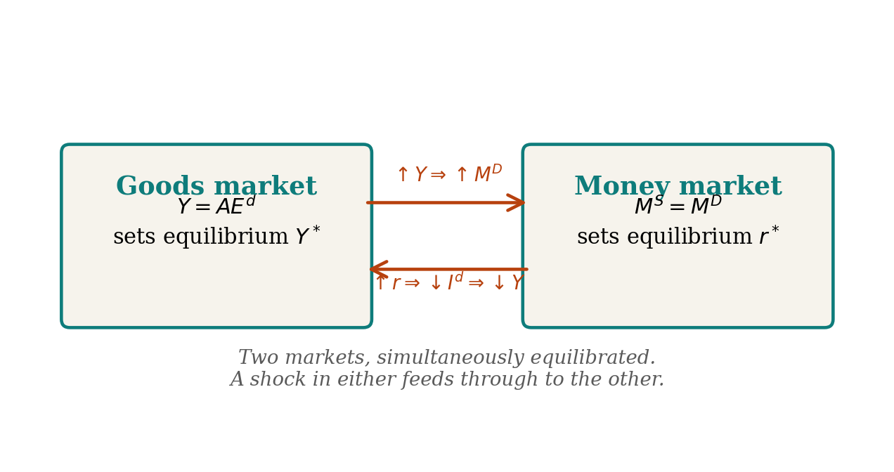

## Three motives for money demand

| motive | what drives it | which curve effect |
|---|---|---|
| **Transactions** | Need money to buy goods. Rises with $Y$ and $P$. | Shifts $M^D$ when $Y$ or $P$ changes. |
| **Precautionary** | Buffer against unexpected spending. | Shifts $M^D$ under uncertainty. |
| **Speculative** | Hold money rather than bonds when bonds look unattractive. Falls with $r$. | Movement *along* $M^D$. |

Sum: $M^D = f(Y, P, r)$. Vertical axis $r$, horizontal $M$. Downward sloping in $r$.

## Equilibrium $r^*$

The Fed sets $M^S$ (vertical line). $M^D$ is the downward-sloping demand curve. $r^*$ is where they cross — but the actual mechanism of adjustment runs through the **bond market**.

{fig-align="center" width="80%"}

When $r > r^*$: excess supply of money. People try to reduce money holdings by buying bonds. Bond prices rise. Bond yields fall. $r$ falls toward $r^*$.

When $r < r^*$: excess demand for money. People sell bonds for cash. Bond prices fall. Yields rise. $r$ rises toward $r^*$.

## What moves $M^S$

Anything the Fed does. OMO purchase shifts $M^S$ right, lowering $r^*$.

{fig-align="center" width="80%"}

## What moves $M^D$

Income $Y$ (transactions motive). Price level $P$ (transactions motive). Uncertainty (precautionary). All three shift the *curve*.

A change in $r$ moves you along the curve, not shift it.

::: {.callout-tip}
**The dual story.** "Fed buys bonds, $M^S$ rises, $r^*$ falls" and "Fed bid up bond prices, so the yield-to-maturity fell" describe the **same transaction**. Money market and bond market are two views of one thing.
:::

## Goods market $\leftrightarrow$ money market

The two markets equilibrate together.

{fig-align="center" width="90%"}

### Monetary policy transmission, end to end

1. Fed conducts an OMO purchase.
2. $\Delta R > 0 \Rightarrow \Delta M^S = K_S \cdot \Delta R > 0$.
3. $\uparrow M^S \Rightarrow \downarrow r^*$.
4. $\downarrow r \Rightarrow \uparrow I^d$ (firms find more projects profitable).
5. $\uparrow I^d \Rightarrow \uparrow AE^d \Rightarrow \uparrow Y^*$ (multiplier $K_I$).
6. $\uparrow Y \Rightarrow \uparrow M^D$ (transactions). $r^*$ rises slightly back. Partial offset.

### Fiscal policy transmission

1. Government raises $\overline{G}$.
2. $\uparrow AE^d \Rightarrow \uparrow Y^*$ (multiplier $K_G$).
3. $\uparrow Y \Rightarrow \uparrow M^D \Rightarrow \uparrow r^*$.
4. $\uparrow r \Rightarrow \downarrow I^d$ (private investment **crowded out**).
5. The crowding-out partially offsets the original boost. This is why the real-world fiscal multiplier is well below $K_G$.
