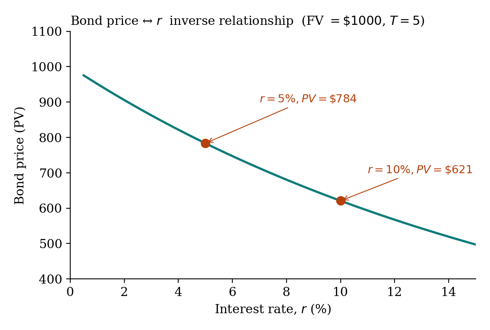

## Present value

A bond is a promise of fixed dollars in the future. Its present value:

$$PV = \frac{FV}{(1+r)^T}$$

where $FV$ is the face value at maturity, $r$ is the market interest rate, and $T$ is years to maturity.

## The inverse relationship

$r$ rises, $PV$ falls. Always. The two cannot move in the same direction.

{fig-align="center" width="80%"}

::: {.callout-tip}
**Why?** A bond is a fixed promise of future dollars. If the discount rate rises, those future dollars are worth less today. Equivalently: if new bonds pay 8% and you hold a 7% bond, no one will pay full face value for yours; its market price falls until its yield-to-maturity matches 8%.
:::

## Backing out $r$

If you know $PV$, $FV$, and $T$:

$$r = \left(\frac{FV}{PV}\right)^{1/T} - 1$$

Take the $T$-th root of $FV/PV$, subtract 1. For $T=2$, square root. For $T=3$, cube root.

## Worked example

$FV = \$1{,}000$. $T = 5$ years. At $r = 5\%$: $PV = 1000/1.05^5 = \$783.53$. At $r = 10\%$: $PV = 1000/1.10^5 = \$620.92$. The bond is worth $\$160$ less.

## Try it

The [bond pricer](../interactive/bond-pricer.qmd) calculates $PV$ given $FV, r, T$ — and inverts to find $r$ given $PV$.
