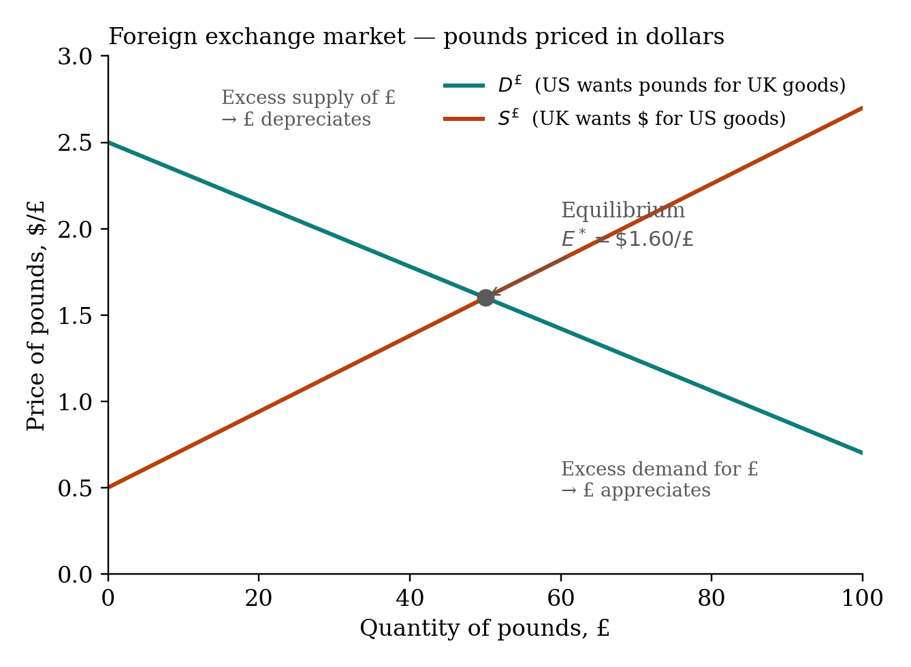
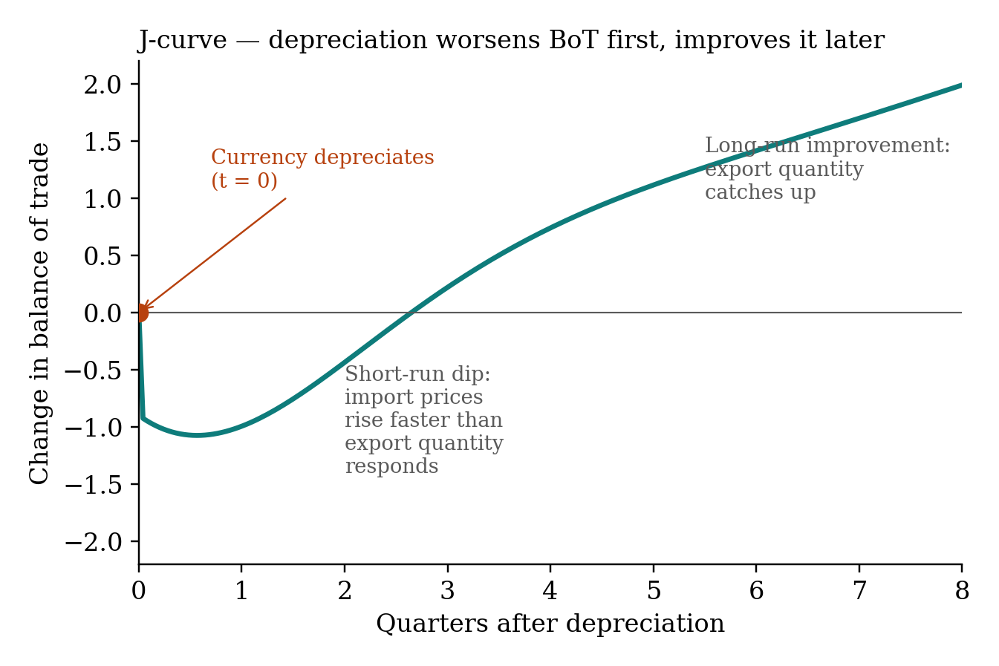

## Balance of payments

Two main accounts:

| account | what it records | sign convention |
|---|---|---|
| **Current account** | Net exports + net investment income + net transfers from abroad | Exports = credit (+); imports = debit (−) |
| **Capital account** | Net change in asset positions across the border | Foreigners buy U.S. assets = credit (+); U.S. residents buy foreign assets = debit (−) |

Identity (floating ER): current account + capital account $\approx 0$. A current-account deficit is financed by a capital-account surplus.

### Sign cheat-table

| transaction | current acct | capital acct |
|---|:---:|:---:|
| U.S. exports to Germany | + | — |
| U.S. imports from Germany | − | — |
| Foreigner buys U.S. Treasury | — | + |
| U.S. resident buys German stock | — | − |
| U.S. earns dividend on foreign stock | + | — |

## The FX market

Two countries: US and UK. Vertical axis is $\$/\pounds$.

Demand for £ (downward sloping): U.S. wants pounds for UK goods.
Supply of £ (upward sloping): UK wants $ for U.S. goods.

{fig-align="center" width="80%"}

## Comparative statics

**Relative inflation (PPP channel).** U.S. inflation rises, UK stable. U.S. goods relatively expensive. U.S. demand for UK goods rises (D for £ shifts right). UK demand for U.S. goods falls (S of £ shifts left). Both push $E_{\$/£}$ up. **The $ depreciates.**

**Relative interest rates (capital-flow channel).** U.S. rates rise relative to UK. U.S. assets more attractive. UK investors sell £ to buy $ (S of £ shifts right). U.S. residents sell $ to buy £ less (D for £ shifts left). Both push $E_{\$/£}$ down. **The $ appreciates.**

::: {.callout-important}
**Inflation and interest rates push the currency in OPPOSITE directions.** Higher inflation depreciates; higher interest rate appreciates. This is the most-tested confusion.
:::

## Purchasing power parity

$$E_{\$/\pounds} = \frac{P_{US,\text{ basket}}}{P_{UK,\text{ basket}}}$$

Same basket should cost the same in either currency. The Big Mac Index is an empirical version. PPP holds well in the long run, poorly in the short run.

Try the [PPP calculator](../interactive/ppp-calculator.qmd).

## Effects of depreciation

A depreciation of the home currency raises home exports, lowers home imports, raises $(X-M)$, raises $Y^*$ via the multiplier, and (because AD shifts right) raises $P$.

But not immediately. The **J-curve** says the trade balance gets worse for 1–4 quarters before improving:

{fig-align="center" width="80%"}

## Trade and price feedback

**Trade feedback effect.** U.S. growth raises imports. U.S. imports are foreign exports, so foreign $Y$ rises. Higher foreign $Y$ raises foreign demand for U.S. exports. Some of the original U.S. boost comes back as exports.

**Price feedback effect.** A supply shock raises U.S. prices. Foreign exporters raise their prices in response. Those higher prices are imported back into the U.S., adding to inflation.

## Beggar-thy-neighbor

A country tries to boost $Y$ via more exports / fewer imports (tariffs, FX manipulation). Other countries retaliate. Global trade shrinks. Everyone loses. The 1930s.
